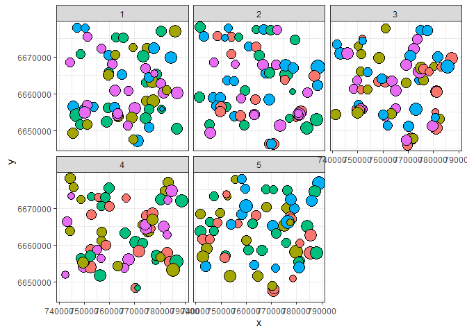
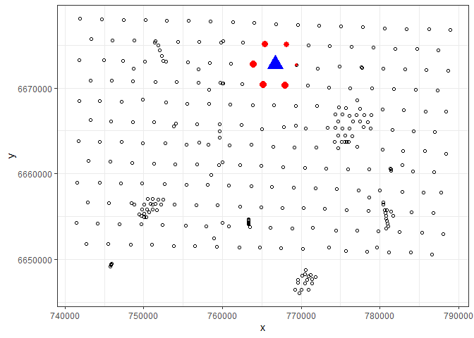
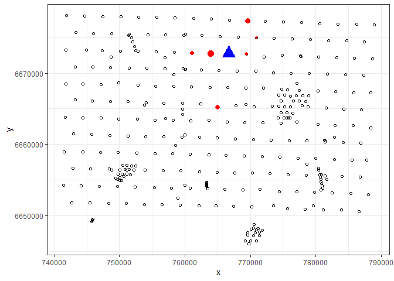
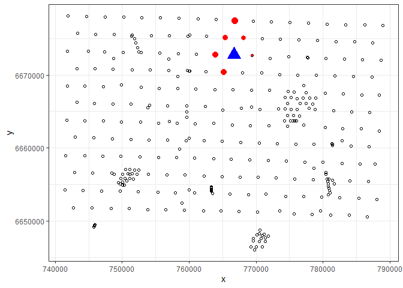

<style>
body {
text-align: justify}
</style>

# Introduction
This work shows the results of applying `soil3D_knn` (with IDW) approach on interpolating Soil Organic Carbon. Within this approach, two variants were explored: standard  and homosoil. Two variants differ only in the way of searching for the neighboring observations. Standard-soil3D knn do the search in the horizontal space, while the Homo-soil 3D knn do the search in the space of predictors (including spatial coordinates). Generally, soil3D knn do the prediction at particular location in 3D soil space (x, y, depth) by doing the following steps:

1. Searching for the **profiles** which have observations within the prediction depth interval (**pdi = prediction depth ± depth threshold**).If there are no observations within the prediction depth interval, it becomes wider for a 5cm in each iteration, until, at least `n.obs` (default is 5) observations are selected. 
1.	From such subset of profiles, k-nearest profiles are selected based on the **gower** distance. For `standard-soil3D_knn` variant only spatial coordinates are included into distance calculation, while for the `homosoil-soil3D_knn` variant, other variables in addition to spatial coordinates, can be included into distance calculation. Generally, the choice of the variables for distance calculation can be set by `soil.fun` parameter (see Implementation)
1.	Then, the predicted value of variable Z:


$$\widehat{Z}=\frac{\sum_{i=1}^{k}{\frac{\overline{Z_i}}{d_i^p}}}{\sum_{i=1}^{k}{\frac{1}{d_i^p}}}$$


where $\overline{Z_i}$ is a weighted mean of $p$ observations (horizons) that intersect with the prediction depth interval:
$$
\overline{Z_i} = \frac{\sum_{i=1}^{p}{w_i \times Z_i}}{\sum_{i=1}^{p}{w_i}}
$$
and $w_i$ is the weight of each observation, from each horizon that intersect the prediction interval, in one neighboring profile. $w_i = \frac{h_i}{prediction \: depth \: interval}$, where $h_i$ is the width of the $i$-th horizon that lie within the prediction depth interval.  

## Gower distance

Gower's distance can be used to measure how different two records are. The records may contain combinations of logical, numerical, categorical or text data. The distance is always a number between 0 (identical) and 1 (maximally dissimilar). An easy to read specifcation of the measure is given in the original paper [Gower (1971): A general coefficient of similarity and some of its properties. Biometrics **27** 857{874.](citeseerx.ist.psu.edu/viewdoc/download?doi=10.1.1.412.4155&rep=rep1&type=pdf).

## The implementaion

The presented approach was implemented in the R package `soil3D_knn`. The package `soil3D_knn` relies on functionalities of several other packages, including: [gower](https://cran.r-project.org/web/packages/gower/index.html) for calculating gower distance and the [tidyverse](https://www.tidyverse.org/) collection of R packages for data manipulation. 

The package `soil3D_knn` can be download and install from [github](https://github.com/pejovic/soil3Dknn).

The package `soil3D_knn` consists of four functions:

Function `soil3D_knn` do the prediction at the the particular location in 3D soil space. Parameters of the functions are:

1. `soil.fun` - formula object that defines the target variables and the predictors which will be used in searching for neighboring profiles. (eg. `OC~x + y + DEM + TWI + depth`. In this case, `x`, `y`, `DEM` and `TWI` will be used as variables in gower distance searching). `depth` is mandatory for 3D soil mapping.   

2. `obs.data` - Observation data. This is `data.frame` with the following columns: `ID`, `Top`, `Bottom`, `Target variable` column, `Covariates` columns, `x`, `y`, `depth`.

3. `pred.data` - Prediction data. This is `data.frame` with the following columns: `ID`, `Covariates` columns, `x`, `y`, `depth`.

4. `n.obs` = number of neighboring profiles.Tuning parameter.

5. `depth_th` - depth treshold. Serves to define prediction depth interval: `pdi = pred.data$depth +/- depth_th`, Tuning parameter.

6. `p` - power of distance. Tuning parameter.


Function `tune_soil3D_knn` performs the cross-validation based tuning of meta-parameters. Parameters of the functions are:

1. `soil.fun` - same as above,   

2. `obs.data` - same as above.

3. `params` - `data.frame` of possible values of parameters (`n.obs`, `depth_th`, `p`).

4. `folds` - vector indicating which profiles belong to each fold.


Function `ncv_soil3D_knn` performs the nested cross-validation procedure for assessing prediction accuracy. Parameters of the functions are:

1. `soil.fun` - same as above,   

2. `obs.data` - same as above,

3. `params` - same as above,

4. `folds` - data.frame with two columns indicating which profiles belong to each fold in outer and inner loop of the nested cross-validation.

Function `stratpart` perform stratified partitioning of the data (profiles). Parameters of the function are:

1. `Target.variables` - variables for stratified data partitioning

2. `sp.data` - class of `SpatialPointsDataFrame` of soil profiles with the target variable values.

3. `num.folds` - number of folds

4. ...


# Experiment

The experiment has involved the applying the `standard soil3D knn` and `homosoil3D knn` on mapping Organic Carbon with data from two case studies, Bor and Edgeroi.

## Case studies

The Bor study area is the smallest but has relatively the most diverse topography. It comprises 206 soil profiles that were andomly sampled over the 10×20 km area in central Serbia (a few kilometers north-east from the town of Bor). For this case study, thirteen continuous and two categorical variables as environmental covariates.

The Edgeroi case study has been previously described in McGarry et al. (1989); Minasny et al. (2006); Malone et al. (2009). The Edgeroi data set (as used in this study) is available via the GSIF package for R (http://gsif.r-forge.r-project.org/edgeroi.html). The data set comprises 359 soil profiles and 15 covariates (13 continual and 2 categorical).

## Data preparation
Data preparation involves loading data, preparing data as soil profile collection, overlaying with spatial covariates grids, and preparing tidy data frame of soil data with the following structure: Each row represent one observation with the following structure: Profile ID, top, bottom, target variable observation, surface covariates, spatial coordinates (x, y). Such `data.frame`also represents the input for the created functions. 


Before, applying nested cross-validation, data were splited into 5 folds (outer and inner). Figure bellow shows five outer folds, while the colors represents the inner partitioning within each fold. 

<!-- -->


## Models

Considering that the `soil.fun` parameter determines which approach will be applied (standard or homosoil), three formulas were selected. `xy.model` includes only spatial coordinates in searching for nearest profiles. `full.model` includes all the predictors, while the `part.model` includes only few commonly used predictors (DEM, TWI and parent material) in addition to spatial coordinates.


### Edgeroi

#### xy.model:

$$
\operatorname{OC} = (\operatorname{x}) + (\operatorname{y}) + (\operatorname{depth}) + \epsilon
$$

#### full.model:

$$
\operatorname{OC} = (\operatorname{MVBSRT6}) + (\operatorname{TI1LAN6}) + (\operatorname{TI2LAN6}) + (\operatorname{PCKGAD6}) + (\operatorname{RUTGAD6}) + (\operatorname{PCTGAD6}) + \\ (\operatorname{LNUABS6}_{\operatorname{4}}) + (\operatorname{LNUABS6}_{\operatorname{5}}) + (\operatorname{LNUABS6}_{\operatorname{6}}) + (\operatorname{LNUABS6}_{\operatorname{10}}) + \\ (\operatorname{LNUABS6}_{\operatorname{13}}) + (\operatorname{LNUABS6}_{\operatorname{14}}) + (\operatorname{LNUABS6}_{\operatorname{16}}) + (\operatorname{LNUABS6}_{\operatorname{19}}) + \\ (\operatorname{LNUABS6}_{\operatorname{21}}) + (\operatorname{LNUABS6}_{\operatorname{26}}) + (\operatorname{LNUABS6}_{\operatorname{27}}) + (\operatorname{LNUABS6}_{\operatorname{28}}) + \\ (\operatorname{LNUABS6}_{\operatorname{30}}) + (\operatorname{LNUABS6}_{\operatorname{33}}) + (\operatorname{LNUABS6}_{\operatorname{34}}) + (\operatorname{LNUABS6}_{\operatorname{36}}) + \\ (\operatorname{LNUABS6}_{\operatorname{37}}) + (\operatorname{LNUABS6}_{\operatorname{38}}) + (\operatorname{DEMSRT5}) + (\operatorname{TWISRT5}) + (\operatorname{PMTGEO5}_{\operatorname{Qrs}}) + \\ (\operatorname{PMTGEO5}_{\operatorname{Qrt/Jp}}) + (\operatorname{PMTGEO5}_{\operatorname{Qrt/Rn}}) + (\operatorname{PMTGEO5}_{\operatorname{Qrt/Tv}}) + (\operatorname{PMTGEO5}_{\operatorname{Tv}}) + \\ (\operatorname{EV1MOD5}) + (\operatorname{EV2MOD5}) + (\operatorname{EV3MOD5}) + (\operatorname{x}) + (\operatorname{y}) + (\operatorname{depth}) + \epsilon
$$

#### part.model:


$$
\operatorname{OC} = (\operatorname{x}) + (\operatorname{y}) + (\operatorname{DEMSRT5}) + (\operatorname{TWISRT5}) + (\operatorname{PMTGEO5}_{\operatorname{Qrs}}) + \\ (\operatorname{PMTGEO5}_{\operatorname{Qrt/Jp}}) + (\operatorname{PMTGEO5}_{\operatorname{Qrt/Rn}}) + \\ (\operatorname{PMTGEO5}_{\operatorname{Qrt/Tv}}) + (\operatorname{PMTGEO5}_{\operatorname{Tv}}) + (\operatorname{depth}) + \epsilon
$$

####


### Bor

#### xy.model

$$
\operatorname{OC} = (\operatorname{x}) + (\operatorname{y}) + (\operatorname{depth}) + \epsilon
$$

#### full.model

$$
\operatorname{OC} = (\operatorname{AHils}) + (\operatorname{Aspect}) + (\operatorname{CatchArea}) + (\operatorname{ChNetBLevel}) + (\operatorname{ConvInd}) + (\operatorname{CrSectCurv}) + (\operatorname{DEM}) + \\ (\operatorname{LongCurv}) + (\operatorname{LSFactor}) + (\operatorname{NegOp}) + (\operatorname{PosOp}) + (\operatorname{RelSlopePosition}) + (\operatorname{Slope}) + (\operatorname{TWI}) + \\ (\operatorname{VelleyDepth}) + (\operatorname{VDistChNet}) + (\operatorname{clc}_{\operatorname{242}}) + (\operatorname{clc}_{\operatorname{243}}) + (\operatorname{clc}_{\operatorname{311}}) + \\ (\operatorname{clc}_{\operatorname{324}}) + (\operatorname{SoilType}_{\operatorname{Dystric\ Cambisol}}) + \\ (\operatorname{SoilType}_{\operatorname{Dystric\ Leptosol}}) + (\operatorname{SoilType}_{\operatorname{Dystric\ Regosol}}) + \\ (\operatorname{SoilType}_{\operatorname{Eutric\ Cambisol}}) + (\operatorname{SoilType}_{\operatorname{Eutric\ Leptosol}}) + \\ (\operatorname{SoilType}_{\operatorname{Mollic\ Leptosol}}) + (\operatorname{SoilType}_{\operatorname{Vertisol}}) + \\ (\operatorname{x}) + (\operatorname{y}) + (\operatorname{depth}) + \epsilon
$$


#### part.model:

$$
\operatorname{OC} = (\operatorname{x}) + (\operatorname{y}) + (\operatorname{DEM}) + (\operatorname{TWI}) + (\operatorname{Slope}) + (\operatorname{depth}) + \epsilon
$$


### Searching for nearest profiles - a visualization

Figures and table bellow show the differences in the results of searching for the nearest profiles. How taking other predictors into searching account influence the searching result. For that purpose, the prediction at the 285. observation from Edgeroi data (blue triangle) was used. It has the depth of 5cm.


```r
edgeroi_df[285, ]
```

```
## # A tibble: 1 x 20
##   ID      Top Bottom    OC MVBSRT6 TI1LAN6 TI2LAN6 PCKGAD6 RUTGAD6 PCTGAD6
##   <chr> <dbl>  <dbl> <dbl>   <dbl>   <dbl>   <dbl>   <dbl>   <dbl>   <dbl>
## 1 399_~     0   10.0 0.920    4.59    18.2   -29.1   0.928   0.172    5.36
## # ... with 10 more variables: LNUABS6 <fct>, DEMSRT5 <dbl>, TWISRT5 <dbl>,
## #   PMTGEO5 <fct>, EV1MOD5 <dbl>, EV2MOD5 <dbl>, EV3MOD5 <dbl>, x <dbl>,
## #   y <dbl>, depth <dbl>
```


#### xy.model:

<!-- -->

and corresponding values (weighted mean of observations from nearest profiles) with gower distances are:


```
## # A tibble: 6 x 5
##   ID                  obs_mean gower_dist       x        y
## * <chr>                  <dbl>      <dbl>   <dbl>    <dbl>
## 1 399_EDGEROI_ed027_1    1.46      0.0512 765413. 6675184.
## 2 399_EDGEROI_ed028_1    1.09      0.0507 768113. 6675084.
## 3 399_EDGEROI_ed044_1    1.72      0.0295 763913. 6672784.
## 4 399_EDGEROI_ed046_1    0.785     0.0300 769413. 6672684.
## 5 399_EDGEROI_ed062_1    1.54      0.0533 765213. 6670384.
## 6 399_EDGEROI_ed063_1    1.61      0.0527 768013. 6670284.
```


#### full.model:
<!-- -->

and corresponding values (weighted mean of observations from nearest profiles) with gower distances are:


```
## # A tibble: 6 x 5
##   ID                  obs_mean gower_dist       x        y
## * <chr>                  <dbl>      <dbl>   <dbl>    <dbl>
## 1 399_EDGEROI_ed011_1    1.28      0.0490 769613. 6677384.
## 2 399_EDGEROI_ed029_1    0.710     0.0648 770913. 6674984.
## 3 399_EDGEROI_ed043_1    0.885     0.0491 761113. 6672884.
## 4 399_EDGEROI_ed044_1    1.72      0.0607 763913. 6672784.
## 5 399_EDGEROI_ed046_1    0.785     0.0482 769413. 6672684.
## 6 399_EDGEROI_ed097_1    1.15      0.0556 765013. 6665184.
```

#### rand.model:


<!-- -->

and corresponding values (weighted mean of observations from nearest profiles) with gower distances are:


```
## # A tibble: 6 x 5
##   ID                  obs_mean gower_dist       x        y
## * <chr>                  <dbl>      <dbl>   <dbl>    <dbl>
## 1 399_EDGEROI_ed010_1    1.87      0.0338 766813. 6677484.
## 2 399_EDGEROI_ed027_1    1.46      0.0305 765413. 6675184.
## 3 399_EDGEROI_ed028_1    1.09      0.0276 768113. 6675084.
## 4 399_EDGEROI_ed044_1    1.72      0.0272 763913. 6672784.
## 5 399_EDGEROI_ed046_1    0.785     0.0195 769413. 6672684.
## 6 399_EDGEROI_ed062_1    1.54      0.0287 765213. 6670384.
```


## Results

Table bellow shows the R squared obtained from nested cross-validation.

<!--html_preserve--><div id="htmlwidget-dee765ee68118ad5ce36" style="width:100%;height:auto;" class="datatables html-widget"></div>
<script type="application/json" data-for="htmlwidget-dee765ee68118ad5ce36">{"x":{"filter":"none","caption":"<caption>R squared obtained from nested cross-validation procedure<\/caption>","fillContainer":true,"data":[["1","2","3"],["xy.model","full.model","rand.model"],[0.53764776579421,0.578301387540204,0.564198339512164],[0.454031650560432,0.469704261567938,0.536044267367011]],"container":"<table class=\"display fill-container\">\n  <thead>\n    <tr>\n      <th> <\/th>\n      <th>model<\/th>\n      <th>Edgeroi<\/th>\n      <th>Bor<\/th>\n    <\/tr>\n  <\/thead>\n<\/table>","options":{"columnDefs":[{"targets":3,"render":"function(data, type, row, meta) {\n    return type !== 'display' ? data : DTWidget.formatRound(data, 2, 3, \",\", \".\");\n  }"},{"targets":2,"render":"function(data, type, row, meta) {\n    return type !== 'display' ? data : DTWidget.formatRound(data, 2, 3, \",\", \".\");\n  }"},{"className":"dt-right","targets":[2,3]},{"orderable":false,"targets":0}],"order":[],"autoWidth":false,"orderClasses":false}},"evals":["options.columnDefs.0.render","options.columnDefs.1.render"],"jsHooks":[]}</script><!--/html_preserve-->


# Conclusion

The obtained results show that 'homosoil' variants (full.model and rand.model) improve the prediction accuracy in comparison to standard knn. In case of Edgeroi data, the improvement is of 4% in R squared, for full.model. In case of Bor, it can be noticed that the `rand.model` performs the best, with the improvement of 9% in R squared. It indicates that the improvement highly depends on the choice of the predictors that are taken into distance calculation.


